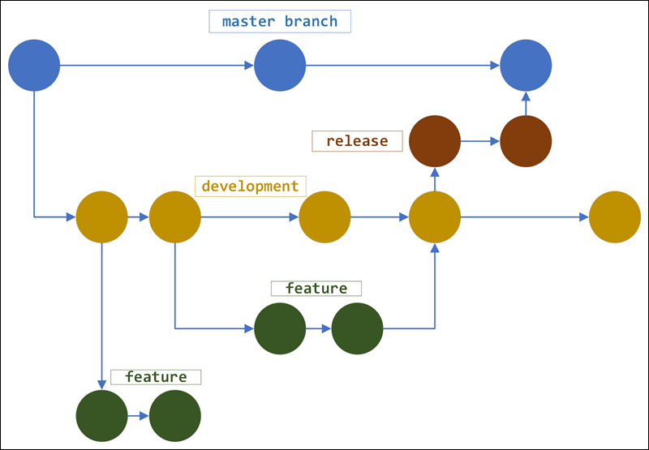

# gitflow

This is a sample repo following the **gitflow** practice.

There are 5 GitHub Actions workflows:

1. `ci-dev.yml`: performs CI when changes are pushed to the `develop` branch.
2. `ci-release.yml`: performs CI when  changes are pushed any of the `release/*` branch.
3. `ci-main.yml`: performs CI when changes are pushed to the `main` branch.
4. `pr-test.yml`: performs testing whenever a Pull Request is opened.
5. `release-yaml`: creates a new tag release on GitHub and Github Container Registry (requires manual trigger).
